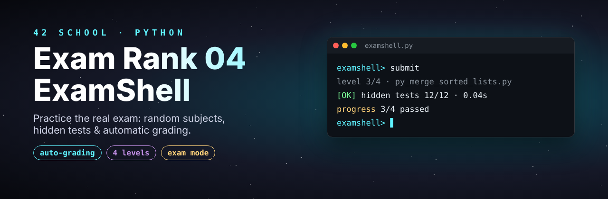
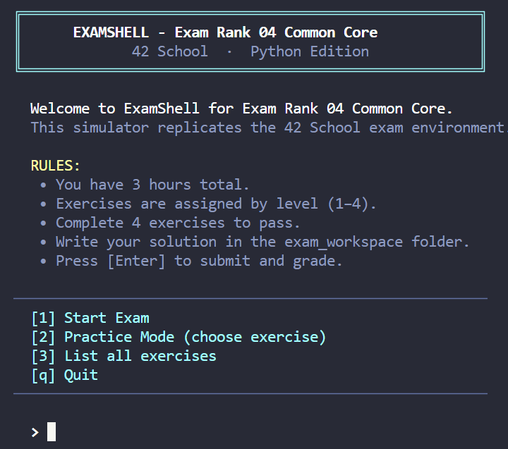
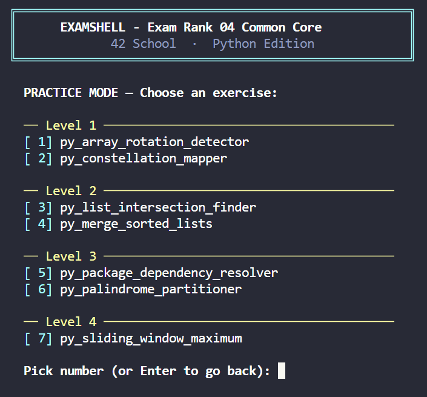
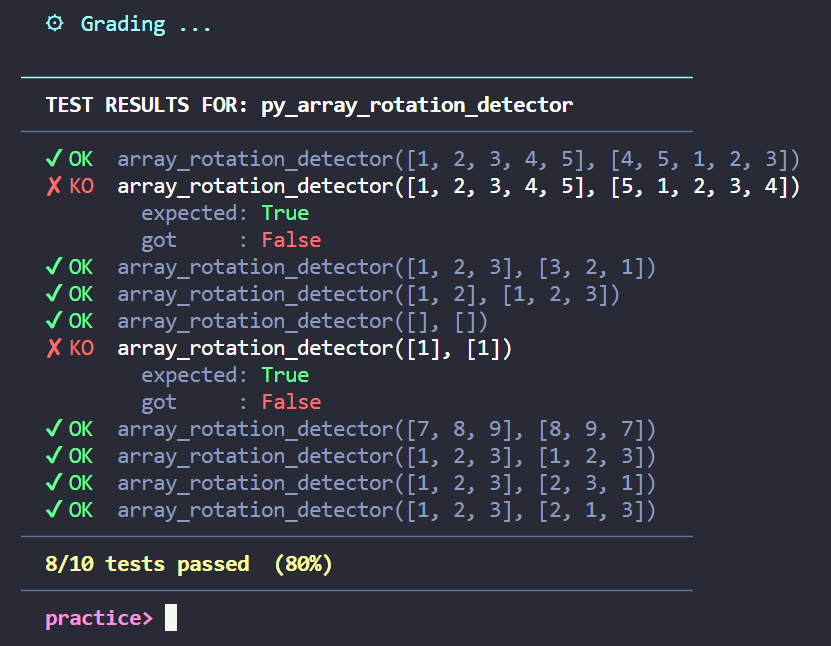

<p align="center">
  
</p>

<h3 align="center">42 Exam Rank 04 (Python) - ExamShell Simulator & Solutions</h3>

<p align="center">
  
  
</p>
<br>
<p align="center">
  <b>Practice the 42 Common Core Rank 04 exam in real conditions:</b><br>
  Random subjects, hidden tests, timeouts and forbidden functions, all from your terminal.
</p>
<br>
<p align="center">
  
</p>

<p align="center">
  <a href="#-quick-start">Quick Start</a> •
  <a href="#-main-feature-examshell-simulator">Features</a> •
  <a href="#️-performance-tests">Performance</a> •
  <a href="#-exam-mode">Exam Mode</a> •
  <a href="#-practice-mode">Practice Mode</a> •
  <a href="#-solutions">Solutions</a>
</p>

---

A Python-based **ExamShell simulator** inspired by the new 42 School Common Core Rank 04 exam, combined with a collection of organized solutions grouped by difficulty level.

---

# 🚀 Quick Start

Clone the repository:

```bash
git clone https://github.com/SaraFreitas-dev/42-Python-ExamShell-Rank04
cd 42-Python-ExamShell-Rank04
```

Run the ExamShell:

```bash
python3 examshell.py
```

You will be presented with the main menu:

```text
[1] Start Exam
[2] Practice Mode
[3] List all exercises
[q] Quit
```

No dependencies, no setup: just Python 3.

---

## 📝 Workspace

When the ExamShell starts, it automatically creates an `exam_workspace` directory.

All exercise files should be created inside this folder. The grader will only validate solutions placed in the generated workspace.

Example:

```text
exam_workspace/
└── py_merge_sorted_lists.py
```

Simply create the requested file, implement your solution, and submit it through the ExamShell interface for automatic evaluation.

---

# ⭐ Main Feature: ExamShell Simulator

The ExamShell is the core of this repository.

It was built specifically to simulate the new Common Core Rank 04 experience and allows students to practice in conditions that are much closer to the real exam than simply reading solutions.

<p align="center">
  
</p>

| Grading | Exam experience | Interface |
|---|---|---|
| Automatic grading | Random exercise assignment | Colored terminal UI |
| Hidden test cases | Progressive level system | Score tracking |
| Performance tests with timeout | Exam & practice modes | Time tracking |
| Forbidden function rules | Rank progression logic | Pure Python |

The workflow mirrors the real exam:

1. Receive a subject
2. Create the requested Python file
3. Implement the solution
4. Submit for grading
5. Fix failing tests
6. Progress to the next level

<p align="center">
  
</p>

---

# ⏱️ Performance Tests

Rank 04 subjects often require solutions that are not only correct, but also efficient.

Some exercises include large hidden inputs. If your solution takes too long, the test is marked as `[TIMEOUT]`, even if the result would eventually be correct:

```text
✘ KO  merge_sorted_lists([[0, 1], [2, 3], [4, 5], ...
        got     : '[TIMEOUT]'
```

> 💡 If you get a timeout, review the complexity of your approach rather than the correctness of the output.

---

# 🎯 Exam Mode

Select:

```text
[1] Start Exam
```

The simulator will:

- Assign exercises automatically
- Increase difficulty after each successful exercise
- Track your score
- Simulate a 3-hour exam session
- Recreate the Common Core Rank 04 workflow

## 🏆 Passing the Exam

The simulator uses a progressive difficulty system.
To successfully complete the exam you must validate:

```text
4 / 4 exercises
```

---

# 🛠 Practice Mode

Select:

```text
[2] Practice Mode
```

Practice Mode allows you to:

- Choose any exercise
- Focus on a specific level
- Submit unlimited times
- Train without time pressure

---

# 📚 Solutions

Solutions are organized by level and include subjects and completed exercises.

```text
solutions/
├── level_1
├── level_2
├── level_3
└── level_4
```

This makes it easy to study specific difficulty ranges or review previously solved exercises.

> ⚠️ Try each exercise in the ExamShell first. Reading solutions before attempting them is the fastest way to fail the real exam.

---

# 📖 Topics Covered

- Lists and nested lists
- Two-pointer techniques
- Merging sorted sequences
- Algorithmic efficiency and time complexity
- Implementing algorithms without forbidden built-ins (`sorted()`, `.sort()`, `heapq`)
- Edge case handling
- Algorithmic thinking

---

---

## ⚠️ Disclaimer

This project is an independent educational tool inspired by the 42 School exam format.

It is not affiliated with or endorsed by 42 School.

---

## 💡 Suggestions

Found a bug, a missing test case or have an idea? Feel free to [open an issue](https://github.com/SaraFreitas-dev/42-Python-ExamShell-Rank04/issues).

---

## ⭐ Support

<h3 align="center">If this repository helped you prepare for the exam, consider giving it a star ⭐</h3>

<p align="center">Good luck and happy coding 🚀</p>